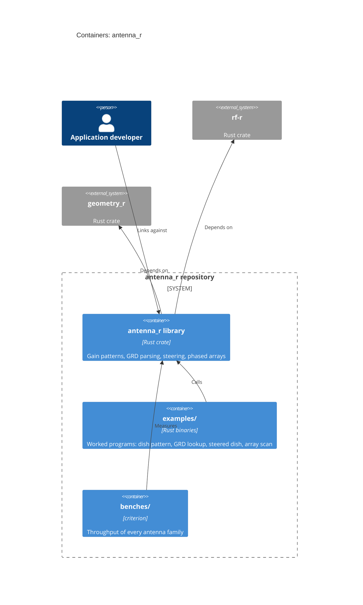

# C4 level 2: Containers

The system is a single library crate. Examples and benchmarks are separate build targets.

```mermaid
C4Container
  title Containers: antenna_r
  Person(developer, "Application developer")
  System_Boundary(b, "antenna_r repository") {
    Container(lib, "antenna_r library", "Rust crate", "Gain patterns, GRD parsing, steering, phased arrays")
    Container(examples, "examples/", "Rust binaries", "Worked programs: dish pattern, GRD lookup, steered dish, array scan")
    Container(benches, "benches/", "criterion", "Throughput of every antenna family")
  }
  System_Ext(rfr, "rf-r", "Rust crate")
  System_Ext(geo, "geometry_r", "Rust crate")
  Rel(developer, lib, "Links against")
  Rel(examples, lib, "Calls")
  Rel(benches, lib, "Measures")
  Rel(lib, rfr, "Depends on")
  Rel(lib, geo, "Depends on")
```
