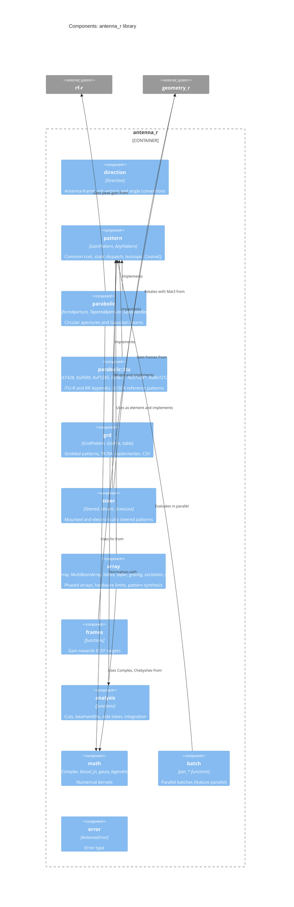

# C4 level 3: Components of the library

```mermaid
C4Component
  title Components: antenna_r library
  Container_Boundary(lib, "antenna_r") {
    Component(direction, "direction", "Direction", "Antenna-frame unit vectors and angle conventions")
    Component(pattern, "pattern", "GainPattern, AnyPattern", "Common trait, static dispatch, Isotropic, CosineQ")
    Component(parabolic, "parabolic", "UniformAperture, TaperedAperture, GaussianBeam", "Circular apertures and Gaussian beams")
    Component(itu, "parabolic::itu", "ItuS465, ItuS580, ItuS1428, ItuF699, ItuF1245, ItuS672, ItuS1528*, ItuBo1213, ItuBo1295, Ap30*", "ITU-R and RR Appendix 30/30A reference patterns")
    Component(grd, "grd", "GridPattern, GrdFile, table", "Gridded patterns, TICRA reader/writer, CSV")
    Component(steer, "steer", "Steered, Mount, ScanLoss", "Mounted and electronically steered patterns")
    Component(array, "array", "PhasedArray, MultiBeamArray, lattice, taper, grating, excitation, synthesis", "Phased arrays, hardware limits, pattern synthesis")
    Component(frames, "frames", "functions", "Gain towards ECEF targets")
    Component(analysis, "analysis", "functions", "Cuts, beamwidths, side lobes, integration")
    Component(math, "math", "Complex, bessel_jn, gauss_legendre", "Numerical kernels")
    Component(batch, "batch", "par_* functions", "Parallel batches (feature parallel)")
    Component(error, "error", "AntennaError", "Error type")
  }
  System_Ext(rfr, "rf-r")
  System_Ext(geo, "geometry_r")
  Rel(parabolic, pattern, "Implements")
  Rel(itu, pattern, "Implements")
  Rel(grd, pattern, "Implements")
  Rel(steer, pattern, "Wraps and implements")
  Rel(array, pattern, "Uses as element and implements")
  Rel(parabolic, math, "Uses Λn from")
  Rel(array, math, "Uses Complex, Chebyshev from")
  Rel(grd, analysis, "Normalises with")
  Rel(frames, geo, "Gets frames from")
  Rel(parabolic, rfr, "Gets peak gain from")
  Rel(steer, geo, "Rotates with Mat3 from")
  Rel(batch, pattern, "Evaluates in parallel")
```

All fallible constructors and parsers return `error::AntennaError`.
